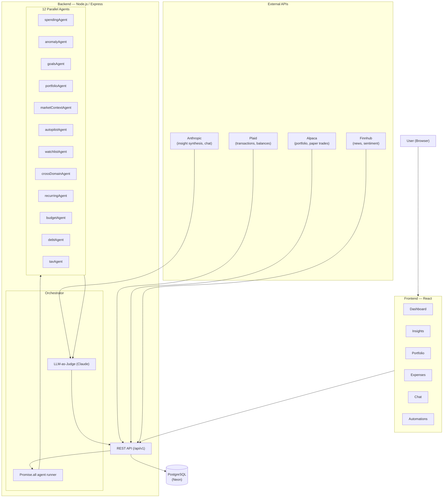

# Agence — AI-Powered Personal Finance & Investment Copilot

Agence is a full-stack personal finance application that deploys multiple AI agents in parallel to analyze a user's complete financial picture and surface prioritized, actionable insights.

The core idea: **Robinhood and Rocket Money exist but don't talk to each other.** Agence connects spending behavior to investment behavior — something no current consumer product does.

---

## What It Does

- **Connect bank accounts** via Plaid — transactions, balances, categories
- **Connect investment accounts** via Alpaca — portfolio positions, P&L, paper trading
- **12 parallel AI agents** analyze every dimension of your finances simultaneously
- **LLM-as-judge** (Claude) synthesizes agent outputs into a single prioritized insight feed
- **Autopilot paper trading** — configure rule-based strategies that execute automatically
- **AI chat** with cross-session memory and financial tools built in
- **Household mode** — shared dashboard and goals with a partner
- **Budgets** — AI-generated budget plans based on actual spending history

---

## Architecture

---

## Agent Architecture

All agents are **pure functions** — `(userData, marketData) => insights[]`. They run in parallel via `Promise.all` and never touch the database or make API calls directly. Data assembly and normalization happens before the agents run.

| Agent | Data Sources | What It Analyzes |
|---|---|---|
| `spendingAgent` | Plaid | Categorized spending, month-over-month changes |
| `anomalyAgent` | Plaid | Unusual or outlier transactions |
| `goalsAgent` | Plaid + Alpaca | Savings goal pace and projected completion |
| `portfolioAgent` | Alpaca | Concentration risk, unrealized P&L, position health |
| `marketContextAgent` | Alpaca + Finnhub | 24h price changes, news sentiment |
| `autopilotAgent` | Alpaca | Rule-based paper trade signal evaluation |
| `watchlistAgent` | Alpaca + Finnhub | Price movers and sentiment for watched tickers |
| `crossDomainAgent` | Plaid + Alpaca | Spending vs. investment alignment, sector overlap |
| `recurringAgent` | Plaid | Subscription detection, upcoming charges |
| `budgetAgent` | Plaid | Monthly budget alerts and overages |
| `debtAgent` | Plaid | High-interest credit card debt detection |
| `taxAgent` | Alpaca | Tax-loss harvesting opportunities, unrealized gain alerts |

---

## Tech Stack

| Layer | Technology |
|---|---|
| Frontend | React (functional components, CSS variables, dark mode) |
| Backend | Node.js + Express |
| Database | PostgreSQL (Neon serverless) |
| Auth | JWT (HS256) |
| LLM | Anthropic Claude (claude-sonnet-4-6) |
| Bank data | Plaid (production) |
| Investment data | Alpaca (paper environment) |
| News/sentiment | Finnhub |
| Hosting | Vercel (frontend) + Render (backend) |
| Testing | Jest + Supertest + fast-check (property tests) + Stryker (mutation) |

---

## Key Design Decisions

**API boundary enforcement**: Alpaca handles only price/portfolio/trade data. Plaid handles only banking/transactions. Finnhub handles only news/sentiment. These boundaries are documented and enforced — mixing them would produce incorrect financial data.

**Sign convention**: Plaid amounts use positive = expense, negative = income. All agents rely on this convention. Normalization at the DB boundary converts pg string/Date types to JS numbers before agents run.

**Streaming insights**: The judge synthesizes insights via a streaming SSE response, so the UI updates in real time as the LLM scores and ranks each insight.

**Fingerprinting**: Each insight has a computed fingerprint based on source + type + key fields. Dismissed insights are filtered by fingerprint, not ID, so they stay dismissed even after a re-run.

---

## Security Posture

- All routes behind JWT auth middleware
- All DB queries parameterized via `pg` placeholders — no string-concatenated SQL
- SQL quarantined in `server/db/queries.js` — no queries outside this file
- Passwords bcrypt-hashed; reset tokens single-use with 1h expiry
- Rate limiting on auth routes (10 req/15 min)
- `helmet()` enabled; CORS restricted to known origins
- SSE streams use one-time tokens (60s OTP) — session JWT never in URL
- `npm audit` + `detect-secrets` gates in CI
